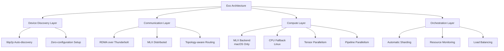
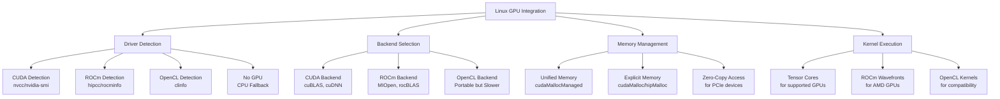
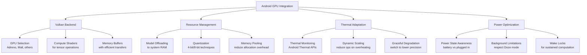
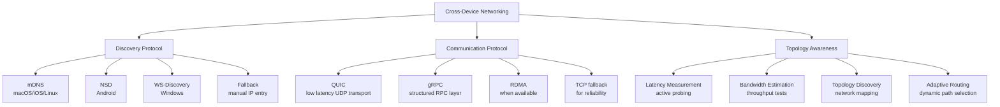
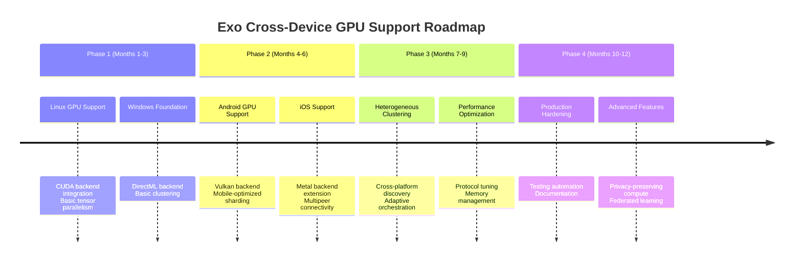
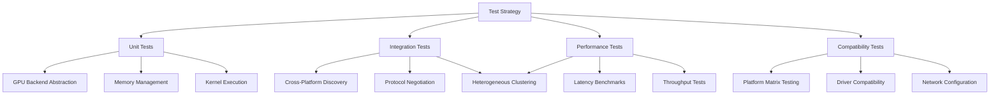

Certainly! I will analyze the exo project and provide a technical approach for enabling cross-device GPU support. The main contents of the report are as follows:

- **Project Overview**: Introduction to exo's architecture and current capabilities.
- **Technical Architecture**: Analysis of current design and platform-specific considerations.
- **GPU Integration Strategy**: Detailed approach for each platform with implementation phases.
- **Cross-Device Communication**: Networking protocols and topology-aware orchestration.
- **Implementation Roadmap**: Phased development plan with testing strategies.

------

# Comprehensive Technical Analysis: Enabling Cross-Device GPU Clustering in Exo

## 1 Project Overview and Current Capabilities

**Exo** is an innovative open-source project that creates **distributed AI clusters** from everyday devices, enabling execution of large language models across multiple hardware platforms. The project currently demonstrates impressive capabilities on **macOS ecosystems** with **Tensor Parallelism** achieving up to 3.2x speedup on 4 devices and **RDMA over Thunderbolt 5** reducing inter-device latency by 99% 【turn0fetch0】. The system uses **MLX (Apple's machine learning framework)** as its inference backend and leverages **MLX distributed** for inter-device communication 【turn0fetch0】. The architecture is built with a **polyglot technology stack** including Python (64.1%), Svelte (18.8%), Swift (7.3%), Rust (4.5%), and TypeScript (3.9%) 【turn0fetch0】, indicating a sophisticated approach to cross-platform development.

The current platform support shows **strong macOS optimization** with GPU acceleration, while **Linux operates in CPU-only mode** with GPU support explicitly marked as under development 【turn0fetch0】. Windows, Android, and iOS platforms are not currently supported according to the repository documentation. The project employs several innovative techniques including **automatic device discovery**, **topology-aware auto parallelization** that considers device resources and network characteristics, and **built-in dashboard** for cluster management accessible at `http://localhost:52415` 【turn0fetch0】. The system's design philosophy emphasizes seamless device integration with zero manual configuration required for cluster formation.

## 2 Technical Architecture Analysis

### 2.1 Current Design Strengths

The exo project demonstrates several **architectural advantages** that form a solid foundation for cross-device GPU support:



The **topology-aware auto-parallelization** capability is particularly noteworthy as it already considers inter-device network characteristics when distributing workloads 【turn0fetch0】. This system creates a **real-time view of device topology** taking into account device resources (memory, compute capability) and network latency/bandwidth between each link 【turn0fetch0】. The implementation of **Tensor Parallelism** with demonstrated performance scaling (1.8x on 2 devices, 3.2x on 4 devices) 【turn0fetch0】 provides a proven approach to distributing model computation across multiple GPUs.

The **communication layer** currently leverages **MLX distributed** with specialized optimizations for **RDMA over Thunderbolt 5** on supported Mac hardware 【turn0fetch0】. This combination enables extremely low-latency communication between devices, which is crucial for distributed inference performance. The system uses **libp2p** for peer discovery and communication, providing a flexible networking foundation that can be extended across platforms.

### 2.2 Platform-Specific Considerations

*Table: Current Platform Support and Technical Requirements*
| **Platform** | **Current Support** | **GPU Requirements** | **Key Challenges** | **Backend Options** |
| :--- | :--- | :--- | :--- | :--- |
| **macOS** | Full GPU support with MLX | Apple Silicon (M1/M2/M3/M4 series) | Thunderbolt 5 RDMA availability | MLX, Metal |
| **Linux** | CPU-only | NVIDIA, AMD, Intel | GPU driver compatibility, CUDA/ROCm integration | CUDA, ROCm, OpenCL |
| **Windows** | Not supported | NVIDIA, AMD, Intel | Driver ecosystem, API differences | DirectML, CUDA, ROCm |
| **Android** | Not supported | Adreno (Qualcomm), Mali (ARM), others | Mobile GPU limitations, thermal constraints | Vulkan, OpenGL ES, OpenCL |
| **iOS** | Not supported | Apple GPU series | App sandbox restrictions, Metal API | Metal |

The **existing codebase structure** reveals several important components that would need platform-specific adaptations:

- **`src/exo/`** - Core Python implementation containing orchestration logic 【turn0fetch0】
- **`rust/`** - Rust components for performance-critical operations 【turn0fetch0】
- **`app/EXO/`** - macOS application bundle with platform-specific code 【turn0fetch0】
- **`dashboard/`** - Node.js/Svelte web interface for cluster management 【turn0fetch0】
- **`mlx_typings/`** - Type definitions for MLX framework integration 【turn0fetch0】

The **dependency management** uses **uv** (Python package manager) and **rustup** for Rust toolchains 【turn0fetch0】, indicating a modern approach to cross-platform development that can be extended to additional platforms. The project's build system shows evidence of **Nix integration** for reproducible builds 【turn0fetch0】, which could be leveraged for maintaining consistency across diverse platforms.

## 3 GPU Integration Strategy by Platform

### 3.1 Unified GPU Abstraction Layer

To enable cross-device GPU clustering, exo must implement a **platform-agnostic GPU abstraction layer** that sits above hardware-specific APIs. This layer would provide a consistent interface for:

- **Device enumeration and capability detection**
- **Memory allocation and management**
- **Kernel execution and data transfer**
- **Synchronization and communication primitives**

The architecture should leverage **existing components** from the codebase while extending them to support multiple GPU backends:

```python
# Conceptual GPU Abstraction Interface
class GPUBackend(ABC):
    @abstractmethod
    def initialize_device(self, device_id: str) -> DeviceHandle:
        """Initialize GPU device and return handle"""
        pass
    
    @abstractmethod
    def allocate_memory(self, size: int) -> MemoryHandle:
        """Allocate device memory"""
        pass
    
    @abstractmethod
    def execute_kernel(self, kernel: Kernel, args: List[Any]) -> None:
        """Execute computational kernel on device"""
        pass
    
    @abstractmethod
    def transfer_data(self, src: MemoryHandle, dst: MemoryHandle, size: int) -> None:
        """Transfer data between devices or host"""
        pass
    
    @abstractmethod
    def get_device_properties(self, device_id: str) -> DeviceProperties:
        """Return device capabilities and characteristics"""
        pass
```

This abstraction would be implemented for each platform's specific GPU API:

- **macOS**: Continue using **MLX** with Metal backend 【turn0fetch0】
- **Linux (NVIDIA)**: Implement **CUDA** backend with existing tensor parallelism strategies
- **Linux (AMD)**: Implement **ROCm** backend with appropriate HIP transformations
- **Windows**: Implement **DirectML** backend for cross-vendor support, with optional CUDA/ROCm for specific vendors
- **Android**: Implement **Vulkan** compute backend for maximum hardware compatibility
- **iOS**: Continue using **Metal** backend with iOS-specific optimizations

### 3.2 Linux GPU Integration Approach

For **Linux platforms**, the current CPU-only implementation 【turn0fetch0】 must be extended to support GPUs. The most practical approach would involve:



The **Rust components** in the existing codebase 【turn0fetch0】 could be leveraged for performance-critical operations, with bindings to CUDA, ROCm, and OpenCL through existing crates such as:

- **`cuda-rs`** or **`cudarc`** for CUDA integration
- **`rocm-rs`** or **`hip-rs`** for ROCm integration  
- **`ocl`** for OpenCL integration

The **Python orchestration layer** would interact with these Rust components through the existing Python-Rust bindings, maintaining the current architecture while extending GPU support. The implementation should prioritize **CUDA support initially** due to its market dominance in AI workloads, followed by **ROCm** for AMD GPU support.

### 3.3 Windows GPU Integration Strategy

**Windows support** presents unique challenges due to differences in the driver ecosystem and application lifecycle compared to Unix-like systems. The implementation should follow this approach:

1. **Driver Detection and Initialization**: Implement detection for multiple GPU vendors (NVIDIA, AMD, Intel) using Windows Management Instrumentation (WMI) and DirectX GPU adapters

2. **Backend Selection**: Implement multiple backends with runtime selection:
   - **DirectML** for cross-vendor support (Windows 10/11)
   - **CUDA** for NVIDIA GPUs (most performant option)
   - **ROCm** for AMD GPUs (if available on Windows)
   - **WARP** (Windows Advanced Rasterization Platform) as CPU fallback

3. **Service Architecture**: Implement exo as a **Windows service** that runs in the background, similar to the macOS app approach 【turn0fetch0】

The Windows implementation would need to address several specific challenges:

```python
# Conceptual Windows GPU Detection
def detect_windows_gpu():
    """Detect available GPUs on Windows platform"""
    import wmi
    
    c = wmi.WMI()
    gpu_info = []
    
    for gpu in c.Win32_VideoController():
        if gpu.Name != "Microsoft Basic Display Adapter":
            capabilities = {
                "name": gpu.Name,
                "driver_version": gpu.DriverVersion,
                "memory": gpu.AdapterRAM,
                "vendor": identify_vendor(gpu.Name)
            }
            gpu_info.append(capabilities)
    
    return select_best_backend(gpu_info)
```

The **Svelte dashboard** 【turn0fetch0】 would require minimal changes as it runs in a browser and communicates through HTTP APIs, making it inherently cross-platform. However, the Windows application wrapper would need to be implemented using **Electron** or **Tauri** (if Rust preference is maintained) to provide the system tray functionality and background service management.

### 3.4 Android GPU Integration Approach

**Android support** requires adapting to the unique constraints of mobile devices, including thermal limitations, power constraints, and diverse GPU architectures. The implementation should follow these principles:

1. **GPU Compute Backend**: Implement using **Vulkan** for maximum hardware compatibility across mobile GPUs (Adreno, Mali, etc.)

2. **Adaptive Performance**: Implement dynamic performance scaling based on:
   - Thermal state (using Android's thermal management APIs)
   - Battery level and power state
   - Current device load and foreground application status

3. **Memory Management**: Aggressive memory management with model offloading techniques due to limited VRAM on mobile devices

The Android implementation would leverage the **existing Python orchestration layer** through **ChaquoPy** or **Kivy** for Python integration, with performance-critical components implemented in:

- **Kotlin/Java** for Android system integration
- **Rust** for Vulkan compute operations (through existing Rust components 【turn0fetch0】)
- **JNI** bindings between Python and native code



### 3.5 iOS GPU Integration Strategy

**iOS support** is most straightforward as it shares the **Metal API** with macOS, allowing significant code reuse from the existing macOS implementation 【turn0fetch0】. The implementation should follow these guidelines:

1. **Metal Backend**: Continue using **MLX** with Metal backend, adapted for iOS-specific Metal features

2. **App Sandbox Compliance**: Adapt the clustering functionality to work within iOS app sandbox restrictions:
   - Use **Network framework** for peer-to-peer discovery (replacing libp2p's mDNS restrictions)
   - Implement **multipeer connectivity** for device discovery and communication
   - Use **shared container** for model storage between apps

3. **Background Execution**: Implement proper background execution modes:
   - **Background processing** for short inference tasks
   - **Background app refresh** for periodic cluster maintenance
   - **Push notifications** for cluster coordination

The iOS implementation would primarily be a **Swift application** that reuses the existing Swift components 【turn0fetch0】 from the macOS app, adapted for iOS form factor and restrictions. The Python orchestration layer could be integrated using **PythonKit** (for Swift) or **BeeWare** for Python-on-iOS support.

## 4 Cross-Device Communication and Orchestration

### 4.1 Unified Networking Protocol

To enable **true cross-device clustering**, exo must implement a unified networking protocol that works across all platforms. The current **libp2p** implementation 【turn0fetch0】 provides a good foundation but needs extensions:



The **networking implementation** should prioritize **low-latency communication** as it is critical for distributed inference performance. The protocol should support:

- **Zero-configuration discovery** using platform-appropriate mechanisms
- **Transport layer negotiation** (QUIC, TCP, UDP, RDMA based on availability)
- **Topology-aware routing** that considers network characteristics
- **Adaptive compression** based on network bandwidth and latency

### 4.2 Heterogeneous Device Orchestration

The **topology-aware auto-parallel** feature 【turn0fetch0】 must be enhanced to handle **heterogeneous device clusters** (e.g., Mac Studio + Android phone + Windows PC). The orchestration should consider:

```python
# Conceptual Heterogeneous Device Scoring
def score_device_for_shard(device_specs: Dict, shard_requirements: Dict) -> float:
    """Calculate device suitability for a specific model shard"""
    
    # Compute capability score
    compute_score = (
        device_specs['gpu_compute_capability'] * 
        device_specs['memory_bandwidth'] * 
        device_specs['tensor_cores']
    )
    
    # Memory suitability score
    memory_score = (
        device_specs['available_memory'] / 
        shard_requirements['memory']
    )
    
    # Network position score
    network_score = (
        1.0 / (device_specs['avg_latency_to_other_nodes'] + 0.001)
    )
    
    # Thermal/power constraint score (for mobile devices)
    thermal_score = 1.0
    if device_specs['form_factor'] in ['mobile', 'tablet']:
        thermal_score = device_specs['thermal_headroom'] / 100.0
    
    # Weighted combination
    total_score = (
        compute_score * 0.4 + 
        memory_score * 0.3 + 
        network_score * 0.2 + 
        thermal_score * 0.1
    )
    
    return total_score
```

The **sharding strategy** should be adapted to handle diverse device capabilities:

- **Tensor parallelism** for devices with similar compute capabilities and high-bandwidth connections
- **Pipeline parallelism** for devices with different performance characteristics
- **Hybrid approaches** that combine both strategies across heterogeneous clusters
- **Dynamic re-sharding** based on runtime performance and device availability

The existing **benchmarking tool** (`exo-bench`) 【turn0fetch0】 should be extended to support heterogeneous device testing, providing insights into optimal partitioning strategies for mixed-device clusters.

## 5 Implementation Roadmap

### 5.1 Phased Development Approach

Implementing cross-device GPU support requires a **phased approach** that builds incrementally on the existing codebase:



**Phase 1: Core GPU Support Expansion**
- Implement **CUDA backend** for Linux with basic tensor parallelism
- Create **Windows foundation** with DirectML backend and basic clustering
- Extend **GPU abstraction layer** to support multiple backends
- Develop **unified device detection** for all platforms

**Phase 2: Mobile Platform Support**
- Implement **Vulkan backend** for Android with mobile-specific optimizations
- Extend **Metal backend** for iOS with multipeer connectivity
- Develop **adaptive performance** management for mobile devices
- Create **mobile-specific UI** for cluster management

**Phase 3: Heterogeneous Clustering**
- Implement **cross-platform discovery** using platform-appropriate mechanisms
- Develop **adaptive orchestration** for heterogeneous device clusters
- Create **dynamic re-sharding** based on runtime performance
- Extend **benchmarking tools** for heterogeneous cluster testing

**Phase 4: Production Hardening**
- Implement **comprehensive testing** across all platforms
- Develop **automated performance profiling** and optimization
- Create **extensive documentation** for deployment and usage
- Add **advanced features** like privacy-preserving compute and federated learning

### 5.2 Testing Strategy

A **comprehensive testing strategy** is essential for ensuring cross-platform compatibility and performance:



The **testing infrastructure** should leverage the existing `exo-bench` tool 【turn0fetch0】 and extend it for cross-platform performance validation. The project should establish a **continuous integration pipeline** that tests across all supported platforms, with automated performance regression detection.

## 6 Conclusion and Recommendations

Enabling **cross-device GPU clustering** in exo is a technically challenging but achievable goal that would significantly democratize access to large-scale AI compute resources. The project's existing architecture provides a solid foundation, particularly the **topology-aware orchestration** and **RDMA-optimized communication** 【turn0fetch0】. The implementation should leverage the existing **polyglot codebase** and **modular design** to support multiple GPU backends across platforms.

The **recommended approach** prioritizes incremental development, starting with Linux GPU expansion and Windows foundation before tackling mobile platforms. The project should maintain the **zero-configuration philosophy** while adding sophisticated **adaptive orchestration** for heterogeneous clusters. By implementing a **unified GPU abstraction layer** and **cross-platform networking protocol**, exo can enable seamless clustering of diverse devices, from Mac Studios to Android phones, creating a truly democratized AI compute platform.

The success of this endeavor will depend on careful **platform-specific optimizations**, particularly for mobile devices with thermal and power constraints. The project should also establish **comprehensive testing** and **benchmarking** to ensure consistent performance across the diverse hardware landscape. With focused development and community engagement, exo has the potential to become the **de facto standard** for personal AI clusters, making massive compute capabilities accessible to everyone.
